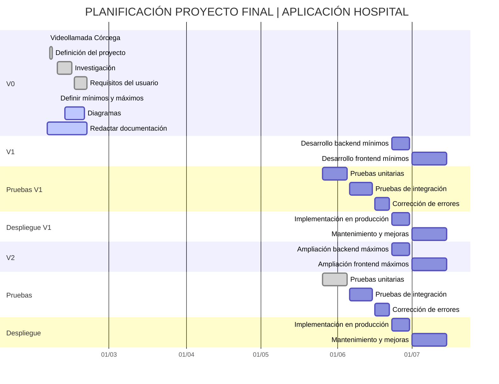

VÍDEO APP

https://youtu.be/TY8uETNxnJg 

```mermaid
gantt
    title PLANIFICACIÓN PROYECTO FINAL | APLICACIÓN HOSPITAL
    dateFormat  YYYY-MM-DD
    axisFormat  %d/%m

    section V0
    Videollamada Córcega          :done,    v0a, 2025-02-04, 2025-02-04
    Definición del proyecto       :done,    v0b, 2025-02-05, 2025-02-06
    Investigación                 :done,    v0c, 2025-02-08, 2025-02-14
    Requisitos del usuario        :done,    v0d, 2025-02-15, 2025-02-20
    Definir mínimos y máximos     :active,  v0e, 2025-02-08, 2025-02-
    Diagramas                     :active,  v0f, 2025-02-11, 2025-02-19
    Redactar documentación        :active,  v0g, 2025-02-04, 2025-02-20

    section V1
    Desarrollo backend mínimos  :        v1a, 2025-06-23, 2025-06-30
    Desarrollo frontend mínimos        :        v1b, 2025-07-01, 2025-07-15

    section Pruebas V1
    Pruebas unitarias              :        des1, 2025-05-26, 2025-06-05
    Pruebas de integración         :        des2, 2025-06-06, 2025-06-15
    Corrección de errores          :        des3, 2025-06-16, 2025-06-22

    section Despliegue V1
    Implementación en producción   :        des4, 2025-06-23, 2025-06-30
    Mantenimiento y mejoras        :        des5, 2025-07-01, 2025-07-15

    section V2
    Ampliación backend máximos  :        v2a, 2025-06-23, 2025-06-30
    Ampliación frontend máximos        :        v2b, 2025-07-01, 2025-07-15

    section Pruebas
    Pruebas unitarias              :done,    des9, 2025-05-26, 2025-06-05
    Pruebas de integración         :        des10, 2025-06-06, 2025-06-15
    Corrección de errores          :        des11, 2025-06-16, 2025-06-22

    section Despliegue
    Implementación en producción   :        des12, 2025-06-23, 2025-06-30
    Mantenimiento y mejoras        :        des13, 2025-07-01, 2025-07-15
```
