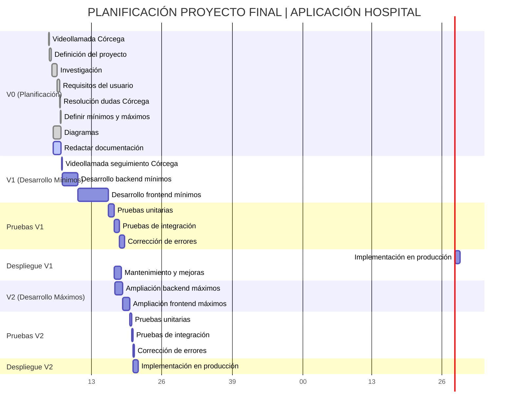

VÍDEO APP

https://youtu.be/TY8uETNxnJg 

IMPORTANTE

TODOS LOS DIAGRAMAS TIENEN SU PROPIO FICHERO.MD, PERO PARA DARLE UN ASPECTO MÁS VISUAL TAMBIÉN SE MUESTRAN EN EL README.MD

DIAGRAMA DE GANTT

```mermaid
gantt
    title PLANIFICACIÓN PROYECTO FINAL | APLICACIÓN HOSPITAL
    dateFormat  YYYY-MM-DD
    axisFormat %W

    section V0 (Planificación)
    Videollamada Córcega          :done, v0a, 2025-02-04, 1d
    Definición del proyecto       :done, v0b, 2025-02-05, 2d
    Investigación                 :done, v0c, 2025-02-08, 7d
    Requisitos del usuario        :done, v0d, 2025-02-15, 3d
    Resolución dudas Córcega      :done, v0e, 2025-02-18, 1d
    Definir mínimos y máximos     :done, v0f, 2025-02-19, 1d
    Diagramas                     :done, v0g, 2025-02-10, 10d
    Redactar documentación        :active, v0h, 2025-02-10, 10d

    section V1 (Desarrollo Mínimos)
    Videollamada seguimiento Córcega    : v1a, 2025-02-21, 1d
    Desarrollo backend mínimos          : v1b, after v1a, 20d
    Desarrollo frontend mínimos         : v1c, after v1b, 2025-04-23

    section Pruebas V1
    Pruebas unitarias                   : des1, after v1c, 7d
    Pruebas de integración              : 7d
    Corrección de errores               : 7d

    section Despliegue V1
    Implementación en producción        : des4, after des3, 7d
    Mantenimiento y mejoras             : des5, 2025-04-30, 10d

    section V2 (Desarrollo Máximos)
    Ampliación backend máximos          : v2a, 2025-05-01, 10d
    Ampliación frontend máximos         : v2b, after v2a, 10d

    section Pruebas V2
    Pruebas unitarias                   : des9, after v2b, 2d
    Pruebas de integración              : des10, after des9, 2d
    Corrección de errores               : des11, after des10, 2d

    section Despliegue V2
    Implementación en producción        : des12, 2025-05-25, 7d
```
