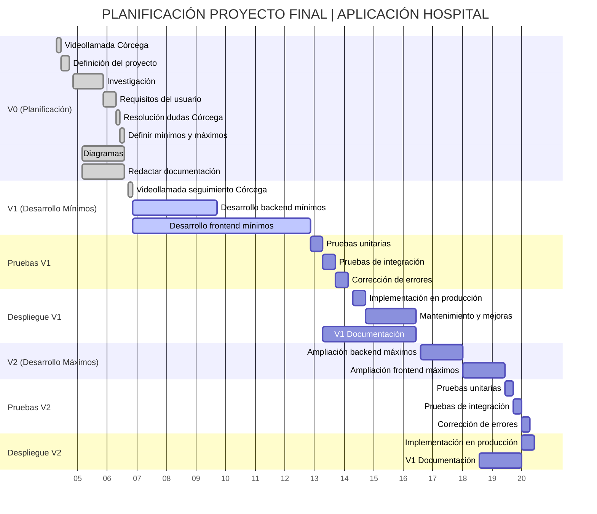
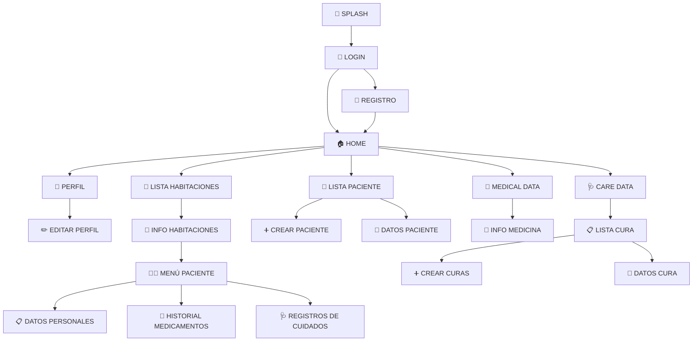

# 🏥 Aplicación de Gestión de Pacientes y Cuidados Médicos

¡Bienvenido a la aplicación de gestión de pacientes y cuidados médicos! 🩺  
Esta aplicación está diseñada para facilitar la administración de pacientes, habitaciones, medicamentos y cuidados médicos en un entorno hospitalario o clínico. A continuación, te explicamos cómo funciona y sus principales características.

---

## 🚀 **Funcionalidades Principales**

1. **Inicio y Autenticación**
- **🌅 Pantalla de carga (SPLASH)**: Al iniciar la aplicación, se muestra una pantalla de carga mientras el sistema se prepara.
- **🔐 Inicio de sesión (LOGIN)**: Los usuarios pueden iniciar sesión con sus credenciales.
- **📝 Registro (REGISTRO)**: Si no tienes una cuenta, puedes registrarte fácilmente para comenzar a usar la aplicación.

2. **Pantalla Principal (HOME)**
- **🏠 HOME**: Una vez autenticado, el usuario es redirigido a la pantalla principal, desde donde puede acceder a todas las funcionalidades.
- **👤 Perfil de Usuario**: Accede a tu perfil para ver y editar tus datos personales.
  - **✏️ Editar Perfil**: Modifica y guarda los cambios en tu información personal.

3. **Gestión de Habitaciones y Pacientes**
- **🚪 Lista de Habitaciones**: Visualiza las habitaciones disponibles.
  - **📄 Información de Habitación**: Al seleccionar una habitación, accede a los detalles del paciente asignado y sus cuidados.
- **👥 Lista de Pacientes**: Visualiza todos los pacientes registrados.
  - **➕ Crear Paciente**: Agrega un nuevo paciente al sistema.
  - **📂 Datos del Paciente**: Accede a la información completa de un paciente seleccionado.

4. **Datos Médicos y Cuidados**
- **💊 Datos Médicos (MEDICAL DATA)**: Visualiza los detalles de los medicamentos prescritos.
  - **📄 Información de Medicamentos**: Revisa la información relevante sobre cada medicamento.
- **🩺 Cuidados (CARE DATA)**: Gestiona los registros de cuidados médicos.
  - **📋 Lista de Cuidados**: Visualiza un listado de las curas realizadas.
  - **➕ Crear Cuidados**: Añade un nuevo registro de cuidados.
  - **📄 Datos de Cuidados**: Accede a la información detallada de un cuidado específico.

---

## 📊 **DIAGRAMA DE GANTT**

---

## 📊 **DIAGRAMA DE CASOS DE USO**

---

## 🎬 **VÍDEO APP**

https://youtu.be/TY8uETNxnJg 

